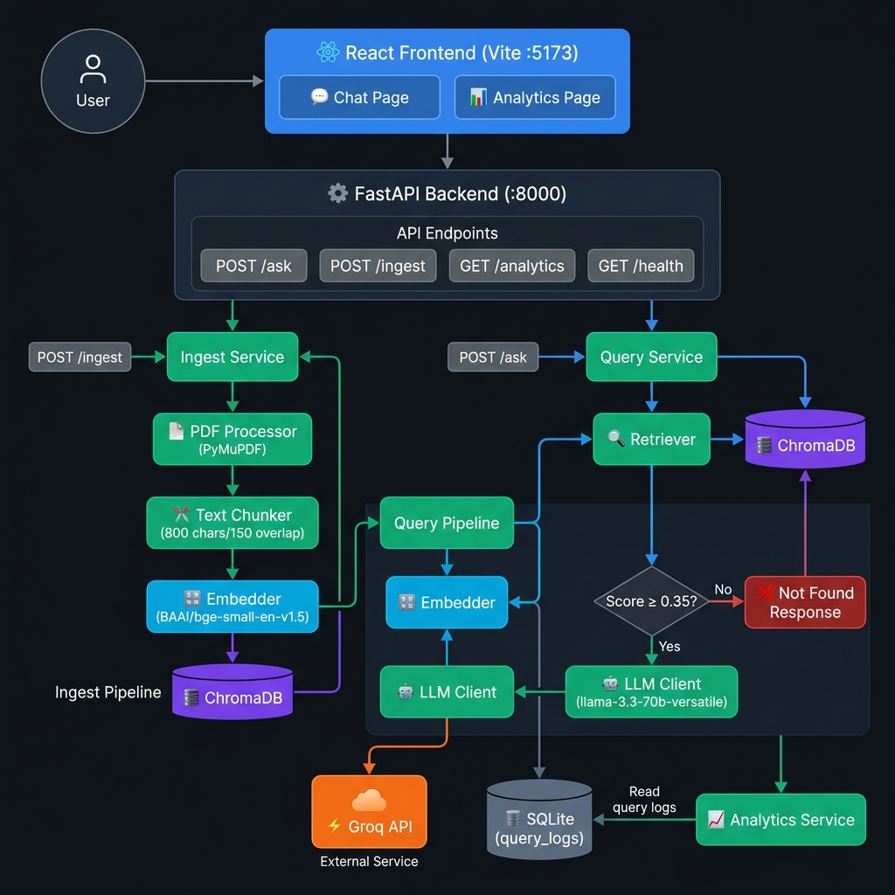

# AWS Customer Agreement — RAG QA System

A production-ready Retrieval-Augmented Generation (RAG) system that answers questions
about the AWS Customer Agreement with grounded, cited responses and zero hallucination.

---

## Architecture Overview




---

## Project Structure

```
Rag_project/
├── backend/
│   ├── app/
│   │   ├── api/            # FastAPI route handlers
│   │   │   ├── ask.py      # POST /ask
│   │   │   ├── ingest.py   # POST /ingest
│   │   │   ├── analytics.py# GET /analytics
│   │   │   └── health.py   # GET /health
│   │   ├── services/       # Business-logic orchestration
│   │   │   ├── ingest_service.py
│   │   │   ├── query_service.py
│   │   │   └── analytics_service.py
│   │   ├── rag/            # RAG pipeline components
│   │   │   ├── pdf_processor.py   # PyMuPDF extraction + chunking
│   │   │   ├── embedder.py        # SentenceTransformer wrapper
│   │   │   ├── vector_store.py    # ChromaDB CRUD
│   │   │   ├── retriever.py       # Threshold-filtered similarity search
│   │   │   └── llm_client.py      # Groq OpenAI-compatible API
│   │   ├── database/       # SQLAlchemy engine + session
│   │   ├── models/         # ORM models (QueryLog)
│   │   ├── schemas/        # Pydantic request/response schemas
│   │   ├── core/           # Config, middleware, exceptions
│   │   └── main.py         # FastAPI application factory
│   ├── tests/
│   ├── data/               # ← Place aws_customer_agreement.pdf here
│   ├── chroma_db/          # Auto-created on first ingest
│   ├── requirements.txt
│   └── .env.example
└── frontend/
    ├── src/
    │   ├── pages/          # ChatPage, AnalyticsPage
    │   ├── components/     # Reusable UI components
    │   └── services/api.js # Axios client
    ├── vite.config.js
    └── package.json
```

---

## Setup Instructions

### Prerequisites
- Python 3.11+
- Node.js 18+
- A valid [Groq API Key](https://console.groq.com/keys)

### Backend

```bash
cd backend

# Create and activate virtual environment
python -m venv .venv
source .venv/bin/activate      # Linux/macOS
.venv\Scripts\activate         # Windows

# Install dependencies
pip install -r requirements.txt

# Configure environment
cp .env.example .env
# Set your GROQ_API_KEY in the .env file!

# Place the AWS Customer Agreement PDF
# Save to: backend/data/aws_customer_agreement.pdf

# Start the server
uvicorn app.main:app --reload --host 0.0.0.0 --port 8001
```

### Frontend

```bash
cd frontend
npm install
npm run dev
# Opens at http://localhost:5173
```

### Ingest the PDF

After the server is running, ingest the document once:

```bash
curl -X POST http://localhost:8001/ingest
```

Or via the Swagger UI at `http://localhost:8001/docs`.

---

## Environment Variables

| Variable              | Default                               | Description                              |
|-----------------------|---------------------------------------|------------------------------------------|
| `GROQ_API_KEY`        | *(required)*                          | Your Groq API key                        |
| `DATABASE_URL`        | `sqlite:///./rag_qa.db`               | SQLAlchemy connection string             |
| `CHROMA_DB_PATH`      | `./chroma_db`                         | ChromaDB persistence directory           |
| `PDF_PATH`            | `./data/AWS Customer Agreement.pdf`   | Path to the source PDF                   |
| `EMBEDDING_MODEL`     | `BAAI/bge-small-en-v1.5`             | HuggingFace sentence-transformer model   |
| `CHUNK_SIZE`          | `800`                                 | Characters per chunk                     |
| `CHUNK_OVERLAP`       | `150`                                 | Overlap between adjacent chunks          |
| `TOP_K`               | `5`                                   | Chunks retrieved per query               |
| `RELEVANCE_THRESHOLD` | `0.35`                                | Minimum cosine similarity to attempt LLM |
| `CORS_ORIGINS`        | `http://localhost:5173,...`           | Allowed CORS origins                     |
| `LOG_LEVEL`           | `INFO`                                | Python logging level                     |

---

## API Documentation

Interactive docs: `http://localhost:8001/docs`

### POST /ingest

Processes the PDF and populates ChromaDB. Idempotent — skips if already ingested.

> The `/ingest` endpoint must be called **once manually** after first run. Subsequent restarts reuse ChromaDB data on disk.
> Re-run with `?force_reingest=true` if you replace the PDF, delete `chroma_db/`, or change chunk settings.

```bash
curl -X POST "http://localhost:8001/ingest"
curl -X POST "http://localhost:8001/ingest?force_reingest=true"
```

**Response 200:**
```json
{
  "message": "Ingestion complete.",
  "chunks_created": 312,
  "pages_processed": 15,
  "collection_name": "aws_agreement_chunks"
}
```

---

### POST /ask

```json
POST /ask
Content-Type: application/json

{ "question": "What are the termination conditions?" }
```

**Response 200:**
```json
{
  "answer": "AWS may terminate the Agreement for convenience with 30 days notice. [Page 8, Chunk p8_c2]",
  "answer_found": true,
  "sources": [
    {
      "page": 8,
      "chunk_id": "p8_c2",
      "snippet": "Either party may terminate this Agreement for any reason with 30 days..."
    }
  ],
  "latency_ms": 1842.3,
  "top_score": 0.7821,
  "tokens_prompt": 1204,
  "tokens_completion": 87
}
```

**Not-found response:**
```json
{
  "answer": "Information not found in the AWS Customer Agreement.",
  "answer_found": false,
  "sources": [],
  "latency_ms": 43.1,
  "top_score": 0.1823
}
```

---

### GET /analytics

Returns aggregated usage statistics. No request body required.

**Response 200:**
```json
{
  "total_requests": 142,
  "success_rate": 0.8732,
  "avg_latency_ms": 1923.4,
  "avg_retrieval_score": 0.6841,
  "top_questions": [{ "query": "What are the payment terms?", "count": 8 }],
  "failed_queries": [{ "query": "What is the weather today?", "count": 2 }],
  "daily_query_counts": [{ "date": "2026-06-17", "count": 23 }],
  "recent_queries": [{ "id": 142, "query": "...", "answer_found": true, "latency_ms": 1820.0 }]
}
```

---

### GET /health

```json
{
  "status": "ok",
  "timestamp": "2026-06-17T14:00:00+00:00",
  "embedding_model": "BAAI/bge-small-en-v1.5",
  "llm_model": "llama-3.3-70b-versatile",
  "groq_status": "ok",
  "vector_store": "ok",
  "chunks_indexed": 312
}
```

## Technology Justifications

### Why ChromaDB?
- **Zero-infrastructure**: embedded, no separate server process needed.
- **Persistent**: `PersistentClient` saves data to disk between restarts.
- **Production-path**: can be swapped for Pinecone/Weaviate with minimal code change.
- **cosine similarity**: legal documents benefit from semantic rather than exact match.

### Why BAAI/bge-small-en-v1.5?
- **State-of-the-art for retrieval**: top performance on MTEB benchmark at its size class.
- **Small footprint**: ~130 MB, runs on CPU in ~50 ms.
- **Asymmetric**: query and passage embeddings are semantically aligned through instruction tuning.
- **Open source**: no API cost for embeddings.

### Why llama3.3:70b via Groq API?
- **Speed**: Groq provides incredibly fast inference times via its LPU technology.
- **Quality**: Meta's LLaMA 3.3 70B instruction-tuned model delivers strong legal text comprehension.
- **OpenAI Compatibility**: Groq provides an OpenAI-compatible API making integration straightforward.

---

## Chunking Strategy

| Parameter     | Value | Rationale |
|---------------|-------|-----------|
| `CHUNK_SIZE`  | 800   | ~150-200 words — fits one complete legal clause or section without truncation. |
| `CHUNK_OVERLAP`| 150  | ~19% overlap — preserves sentence context at boundaries; prevents losing information when a clause spans a chunk boundary. |

The AWS Customer Agreement uses numbered sections and sub-clauses. 800-character chunks typically capture a complete clause, and the 150-character overlap ensures the beginning of the next clause provides context for the end of the current one.

---

## Retrieval Strategy

1. **Embedding**: Query is embedded with BGE query prefix (`"Represent this sentence: "` + query). Document chunks are embedded without prefix. This asymmetric approach is required by BGE's training regime.
2. **Similarity**: ChromaDB uses HNSW index with cosine distance. Distance is converted to similarity: `similarity = 1 - distance`.
3. **Top-K=5**: Retrieves 5 candidate chunks to give the LLM sufficient context without exceeding the context window.
4. **Threshold=0.35**: If the best similarity score is below 0.35, the query is considered out-of-scope and the system returns "not found" without calling the LLM. This prevents hallucination on off-topic queries.

---

## Grounding Strategy

The LLM receives a strict system prompt:
- Answer **ONLY** from the provided context.
- If the answer is not in the context, respond with the exact phrase: *"Information not found in the AWS Customer Agreement."*
- Quote directly from context when possible.
- Reference page and chunk IDs.
- `temperature=0.0` for deterministic, non-creative outputs.

This is enforced at both the retrieval layer (threshold) and the generation layer (system prompt + temperature).

---

## Analytics Design

All analytics are computed from the `query_logs` SQLite table on every `GET /analytics` call. The table is indexed on `created_at` for efficient date-grouped queries. SQLite's `strftime` function handles daily aggregation without an ORM workaround.

Metrics tracked:
- Success rate (answer found vs not found)
- Latency percentiles (currently avg — p50/p95 can be added)
- Top repeated questions (identify FAQ candidates)
- Unanswered questions (identify document gaps or coverage needs)
- Daily volume (trend monitoring)

---

## Running Tests

```bash
cd backend
pytest tests/ -v

# Skip model-loading tests (marked @pytest.mark.slow) for CI speed:
pytest tests/ -v -m "not slow"
```

---

## Demo Instructions

1. Start backend: `uvicorn app.main:app --reload`
2. Ingest: `curl -X POST http://localhost:8000/ingest`
3. Start frontend: `npm run dev` (in `/frontend`)
4. Open `http://localhost:5173`
5. Try these questions:
   - *"What are the payment terms?"*
   - *"Can AWS suspend my account?"*
   - *"What happens upon termination of the agreement?"*
   - *"What is the limitation of liability?"*
   - *"What is the weather in Seattle?"* (should return "not found")

---

## Future Improvements

- **Re-ranking**: Add a cross-encoder re-ranker (e.g. `cross-encoder/ms-marco-MiniLM-L-6-v2`) for higher precision.
- **Streaming**: Use SSE streaming for incremental answer display.
- **Multi-document**: Support multiple PDFs with per-document filtering.
- **Caching**: Cache embeddings and LLM responses for repeated identical questions.
- **Authentication**: Add API key auth for production deployment.
- **Docker**: Containerise backend and frontend for one-command startup.
- **PostgreSQL**: Swap SQLite for PostgreSQL for concurrent write workloads.
- **Evaluation**: Add RAGAS evaluation pipeline to measure faithfulness and relevance.

---


